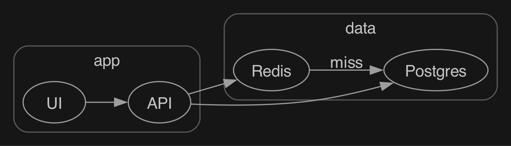
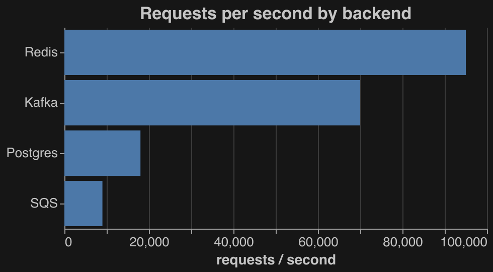

# viz

A Claude Code mod that draws structure in the model's replies instead of
leaving it as text. The model writes a fenced ```viz block holding one JSON
object; the mod draws it in place of the block.

| Type | What it draws | How |
| --- | --- | --- |
| `compare` | options side by side against criteria, best values and a pick marked | Box and Text |
| `timeline` | ordered steps with done / active / todo / blocked | Box and Text |
| `code` | lines read from a file on disk, with notes on chosen lines | Box and Text |
| `trace` | an execution path: places, call depth, kinds, lines from disk | Box and Text |
| `tree` | flat file paths as a directory tree with change marks | Box and Text |
| `sequence` | participants with text lifelines and arrows | Box and Text |
| `types` | shapes with fields and links between them | `dot` → PNG → Image |
| `graph` | Graphviz `dot` source as a diagram | `dot` → PNG → Image |
| `chart` | a Vega-Lite spec with inline data | `vl2svg` → `rsvg-convert` → PNG → Image |

While a block streams in, the mod holds it back so raw JSON never shows, and the
spinner says what it is drawing. Pictures use the terminal's dark colors on a
transparent background (`THEME` in `hooks/graph.ts`). Where a surface cannot
show a picture, a graph shows its dot source and a chart its data as a table.

## Gallery

Graph and chart blocks are drawn as pictures:





`compare`, `timeline`, `tree`, `code`, `trace` and `sequence` are drawn as text
layouts, so they work in any terminal.

## Terminals

- **Text blocks** (`compare`, `timeline`, `tree`, `code`, `trace`, `sequence`)
  work in any terminal that runs Claude Code.
- **Pictures** (`graph`, `chart`, `types`) need the kitty graphics protocol.
  Ghostty and kitty are the ones this was built against. WezTerm also
  implements the protocol, but it is untested here.
- **Anywhere else** a graph shows its dot source and a chart its data as a
  table, so nothing is lost, only not drawn.
- In Ghostty, Claude Code may keep images off until the terminal confirms the
  protocol. See Known quirks for the setting that turns them on.

## Use

Once installed, ask for structure in plain words: "compare these three options",
"show the steps as a timeline", "draw how these modules relate", "chart these
numbers". The model answers with a short sentence and a ```viz block, which the
mod draws. `VOCABULARY.md` lists every shape and field. Run `/viz-open` to open
the latest picture in Preview when it is too small to read in the terminal.

Example block:

````
```viz
{"type":"timeline","steps":[{"label":"Write","status":"done"},{"label":"Ship","status":"active"}]}
```
````

## Requirements

- Claude Code with mods (function hooks); built against 2.1.289
- Graphviz (`dot`) and librsvg (`rsvg-convert`) on the PATH, e.g. `brew install graphviz librsvg`
- Node.js, for the chart renderer
- For pictures: a terminal with the kitty graphics protocol (Ghostty, kitty)

## Install

```sh
git clone https://github.com/jjaskulis/claude-code-viz ~/Dev/viz-mod
cd ~/Dev/viz-mod/renderers && npm install
```

Load it in every session through the `env` block of `~/.claude/settings.json`:

```json
{ "env": { "CLAUDE_CODE_PLUGIN_DIRS": "~/Dev/viz-mod" } }
```

Then teach Claude the language, see below.

## Teach Claude the language

The mod only draws blocks. Claude writes them only if it has read
`VOCABULARY.md`, which lists every block type, its fields and an example.
Without it, Claude never emits a ```viz block.

Import it from `~/.claude/CLAUDE.md` to teach every session:

```
@~/Dev/viz-mod/VOCABULARY.md
```

Or put the same line in one project's `CLAUDE.md` to teach only that project.
You can also paste the file's contents in. A mod's own system-prompt hooks can
be blocked by managed policy, which is why the mod does not inject it itself.

Check it worked: start a new session and ask "compare Redis and Postgres as a
queue". You should see a drawn comparison, not raw JSON.

## Known quirks

- Claude Code keeps images off until the terminal confirms kitty graphics, which
  did not happen in Ghostty here. The undocumented `CLAUDE_CODE_FORCE_TERMINAL_IMAGES=1`
  turns them on; set it only for Ghostty (`env = CLAUDE_CODE_FORCE_TERMINAL_IMAGES=1`
  in the Ghostty config). A session handed out by Claude Code's background daemon
  keeps the daemon's environment, so start `claude` directly in the terminal.
- The engine follows `$` only into functions of the hooks module's own file, so
  everything that calls `$` lives in `hooks/register.tsx`.

## Develop

```sh
claude plugin validate .
claude plugin test .
npx -p typescript@5 tsc -p .
```

## License

MIT, see `LICENSE`.
